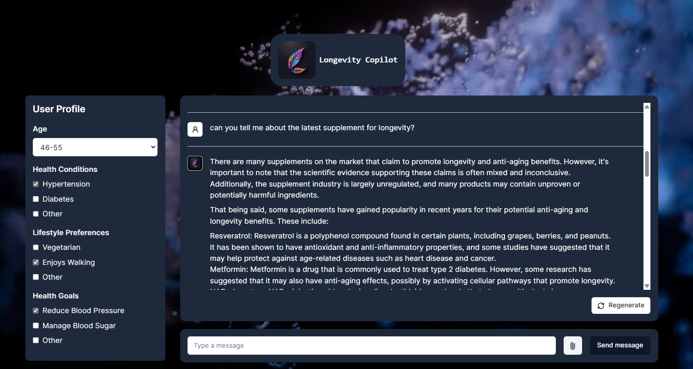

<table>
  <tr>
    <td>

    </td>
    <td style="padding-left: 40px;">
<h3><strong>Welcome to the official repository for                 Longevity Copilot.  
     
Longevity Copilot is aiming to integrate cutting-edge  
 AI technology to bring the latest longevity research   
 and applications to all.<strong></h3>
    </td>
  </tr>
</table>

<h3 align="center">Try out our AI Age Prediction FREE⤵️</h3>

https://github.com/LangLabsIO/longevity-copilot-hackathon/assets/29067169/047f08cd-429a-449c-a0f0-008b589d0b75

<h1 align="center"><a href="https://longevity.so/free">🖱️Try Now *click*</a></h3>

## About Us

### Our Journey to Enhancing Life Through AI and Longevity Science

Our journey began in the halls of academia where our CEO, Blaise Pascual, was inspired by cutting-edge research  
in biomedical studies and longevity. Motivated by a vision to democratize access to longevity research  
we set out to develop Longevity-Copilot—a platform that combines advanced AI with the latest in life-extending science.

At Longevity-Copilot, our mission was clear from the start: to empower people with knowledge and cutting-edge  
tools to enhance their longevity. We aimed to provide personalized, professional, and privacy-oriented  
recommendations tailored to each user’s unique lifestyle factors—age, health, exercise, and dietary habits.

The road to innovation is often fraught with challenges. Our team initially struggled to integrate  
and streamline vast amounts of data effectively. We grappled with unfamiliar frameworks and the daunting  
task of ensuring seamless integration among various components of our project.

The breakthrough came when we dedicated ourselves to mastering these frameworks.  
Through perseverance and relentless teamwork, we developed a robust system capable of ingesting  
and processing complex data sets, paving the way for sophisticated prompt engineering and user interface enhancements.

With the major hurdles behind us, we focused on refining our chatbot’s interactions and improving the overall user experience.  
Our collaborative spirit was crucial in overcoming time zone differences and tight schedules.

Today, Longevity-Copilot is set to be a cornerstone of a larger initiative aimed at revolutionizing the longevity field.  
Our platform stands ready to introduce powerful AI-driven insights to an eager global audience, potentially  
transforming how we understand and enhance human lifespan.

This project has reshaped our team and strengthened our resolve. We've become a more cohesive unit, keenly aware  
of our collective strengths and weaknesses. It has reaffirmed our belief in the power of unity and meticulous planning.

As we look to the future, we are driven by a conviction that nothing is impossible when innovative minds work together.  
Longevity-Copilot is not just a tool but a testament to what can be achieved when passion meets technology.

Join us on this remarkable journey to redefine the boundaries of what's possible in longevity and health.  
Your story of enhanced life and vitality starts here.

### About Longevity-Copilot

Longevity-Copilot is an advanced RAG (Retrieval-Augmented Generation) chatbot  
designed to democratize access to the latest longevity research and practical applications.  
By providing real-time, personalized responses, this chatbot helps users integrate  
longevity-enhancing practices into their daily lives.

Whether you're looking to understand complex scientific research or seeking practical advice  
on lifestyle adjustments, Longevity-Copilot offers tailored recommendations based on individual  
age, dietary habits, health conditions, and exercise routines. This tool makes longevity science accessible  
and actionable for everyone, ensuring that users can make informed decisions about their health and well-being.

## Features

- **Tailored Recommendations:** Get personalized health and lifestyle advice that considers your unique circumstances such as age, diet, health issues, and physical activity levels.
- **Cutting-Edge Research:** Stay updated with the latest findings in longevity science. Longevity-Copilot integrates contemporary research directly into your interaction with the AI.
- **User-Friendly AI:** Engage in natural, easy-to-understand conversations with our AI, making complex longevity research relatable and easy to comprehend.
- **Real-Time Answers:** Have a question about longevity? Our chatbot provides real-time responses to help you apply longevity science in your daily life effectively.  
   

**Longevity-Copilot is aimed for receiving information, and by no mean is it a replacement for  
a professional healthcare provider. It is a tool that can be used by anyone, anywhere, and at any time.**

  
  
Longevity-Copilot chatbot  
 

## Technologies Used

- **Programming Languages:**

  - **Backend**: Python 3.10+
  - **Frontend**: JavaScript and TypeScript (Next.js 14 for frontend development).
  - **Ingest**: Python 3.10+ . Scripts for data handling and processing.

- **Frameworks and Libraries:**
  - **Unstructured.io:** Powers data feeding into Vectara for enhanced data handling.
  - **Vectara:** Used for robust data ingestion and storage solutions.
  - **LlamaIndex:** Manages data indexing and oversees chat interaction functionalities.
  - **Together.ai:** For bridging to large language models, facilitating efficient querying processes.

## Getting Started

To get started with this project, clone the repository and follow the installation instructions below.

### Prerequisites

- Python 3.10+
- Next.js 14+
- Yarn package manager

### Installation

### Clone the repository:

_git clone https://github.com/LangLabsIO/longevity-copilot-hackathon.git_  
_cd longevity-copilot-hackathon_

### create a virtual environment: (conda is a good choice)

_conda create -n longevity-copilot-env python=3.10_  
(you can use Python 3.10 or higher.)  
_conda activate longevity-copilot-env_

### To run ingest:

create a .env file in the ingest folder and add the following variables:  
VECTARA_API_KEY =  
VECTARA_CUSTOMER_ID =  
VECTARA_CORPUS_ID =  
VECTARA_OAUTH_CLIENT_ID =  
VECTARA_OAUTH_SECRET =

Follow this link to the [ingest Readme](./ingest/README.md) file.

### To run backend:

Follow this link to the [backend Readme](./backend/README.md) file.

### To run frontend:

Follow this link to the [frontend Readme](./frontend/README.md) file.

## How to Contribute

We welcome contributions from the community and are excited to see how you can help Longevity-Copilot grow!  
Here are some ways you can contribute:

- **Reporting Bugs:** Report bugs by opening an issue in the GitHub repository.
- **Suggesting Enhancements:** Have an idea to make Longevity-Copilot even better? Open an issue and we might just incorporate your suggestions!
- **Pull Requests:** Pull requests are always welcome. Please ensure you follow the existing code style and contribute to making the documentation comprehensive.

1. Fork the Project
2. Create your Feature Branch (`git checkout -b feature/AmazingFeature`)
3. Commit your Changes (`git commit -m 'Add some AmazingFeature'`)
4. Push to the Branch (`git push origin feature/AmazingFeature`)
5. Open a Pull Request

## License

Longevity-Copilot is made available under the [MIT License](https://opensource.org/licenses/MIT).  
By using, distributing, or contributing to this project, you agree to the terms and conditions of this license.

## Acknowledgments

- Thanks to everyone who participates in and supports the hackathon.
- Special thanks to LabLab for hosting this event.
